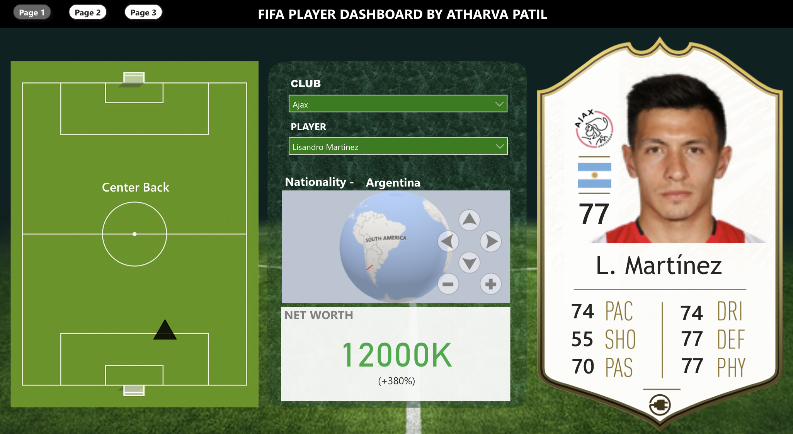
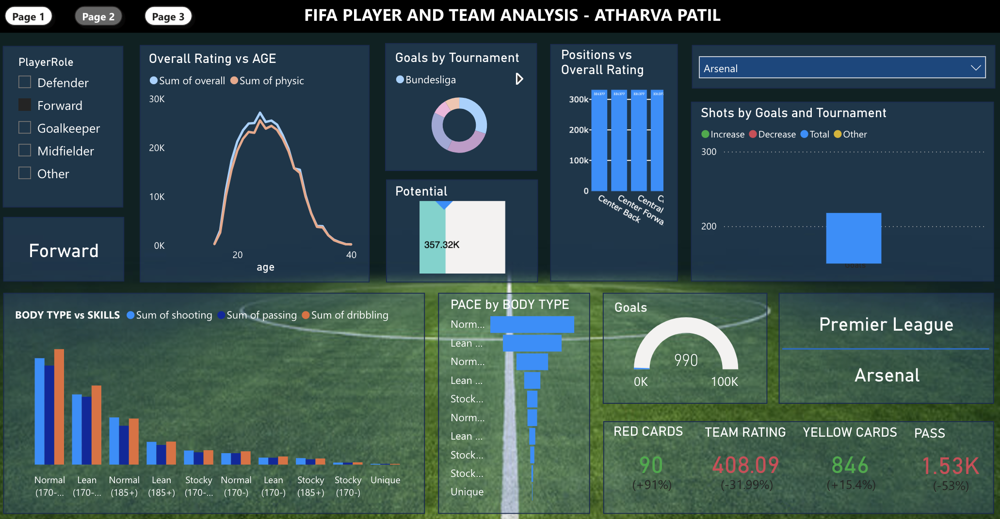
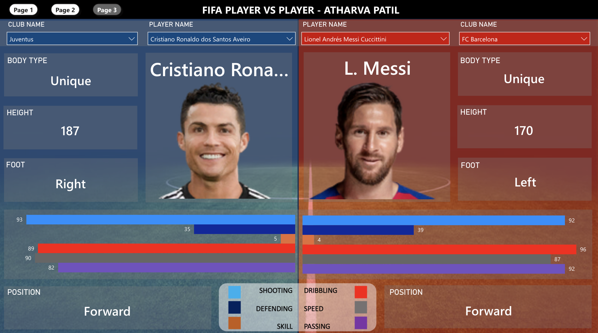

# FIFA Player Dashboard

## Overview
This Power BI dashboard provides an interactive, data-driven visualization of FIFA 2020 player statistics. The dashboard consists of three pages, each offering unique insights into players, teams, and their performance. Users can explore detailed player info, analyze various stats, and even compare two players head-to-head.

You can view the dashboard [here](https://app.powerbi.com/view?r=eyJrIjoiZWE0OTg0MDAtNzQzYi00ZjgzLWE3N2EtMzMxNDAyM2U2Y2Q1IiwidCI6ImQxZjE0MzQ4LWYxYjUtNGEwOS1hYzk5LTdlYmYyMTNjYmM4MSIsImMiOjEwfQ%3D%3D)

## Pages

### 1. **Player Info Page**
   - Displays a **FIFA-style player card** including player image, stats, country and club flags.
   - A **scatter plot** on a football field visualizes player positions.
   - Shows the player’s **nationality on a globe map** and their **net worth**.
   - Users can select players through **club and player slicers**.

  

  

### 2. **Analysis Page**
   - Provides **graphs and analysis** for players and teams.
   - Visualizes **positions vs. various stats** and **teams vs. goals** through bar charts, column charts, and more.
   - Analyzes player performance across different metrics to provide insights.

  

### 3. **Player Comparison Page**
   - Enables **side-by-side comparison** of two players.
   - Displays **bar graphs** comparing key stats like speed, defense, shooting, passing, etc.
   - Shows additional info such as **player positions, strong foot**, and other key attributes.

  

## Features
- **Interactive Slicers**: Filter the dashboard by club, player, or other attributes.
- **Dynamic Visuals**: Real-time data updates based on slicer selection.
- **Player Comparison**: Compare two players on a variety of skills and stats.
- **Global Representation**: View player nationality on an interactive globe map.

## Technologies Used
- **Power BI**: To create interactive visualizations and reports.
- **DAX**: For custom measures and calculated columns.
- **Data Modeling**: Establishing relationships between datasets for effective filtering and drill-downs.

## How to Use
1. **Navigate Between Pages**: Use the page navigation buttons to switch between Player Info, Analysis, and Comparison.
2. **Select Players**: Use the slicers to filter by team or player to view specific information.
3. **Compare Players**: Head to the comparison page to compare two players across various metrics.

## Data:
3 datasets were gathered for player info, player image urls, player team info from kaggle
